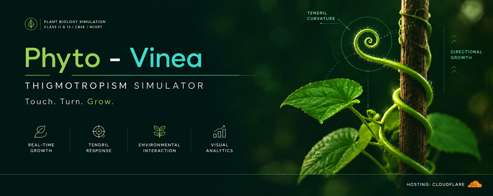

  

# 🌿 Phyto-Vinea

### *Interactive Thigmotropism Simulator*

> **Phyto-Vinea** is an interactive visualization exploring **plant thigmotropism, mechanical touch perception, tendril coiling, and differential growth**.
>
🌿 **Plant Physiology** · 🌀 **Thigmotropism** · 🧪 **Auxin**

**🔬 [Explore the Simulation](https://phyto-vinea.dray-ashcroft.workers.dev/)**

---

## ✦ Features

**🌱 Dynamic Growth**  
Observe tendril coiling in response to mechanical contact.

**🪴 Interactive Support**  
Position a support structure to trigger thigmotropic growth.

**🧪 Auxin Visualization**  
Explore auxin redistribution during differential growth.

**📱 Responsive Design**  
Optimized for modern desktop and mobile devices.

---

## 🧬 Core Concepts

**Thigmotropism · Mechanical Stimulus · Tendril Coiling · Auxin Redistribution · Differential Growth · Plant Physiology**

---

## ⚙️ Technology

**HTML · CSS · JavaScript**

**Repository:** GitHub & Codeberg  
**Hosting:** GitHub Pages

---

## 📜 License

Distributed under the **GNU General Public License v3.0 (GPL-3.0)**.
